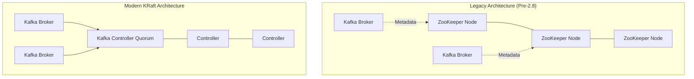

# Module 4, Lecture 2: Apache Kafka Overview & Architecture

Transitioning from abstract event streaming concepts to a concrete implementation requires a system capable of handling relentless data velocity without dropping state. Apache Kafka is the de facto standard for this tier of infrastructure.

---

## 1. The Operational Scope of Kafka

Originally engineered at LinkedIn to handle massive volumes of user activity telemetry (page views, keystrokes), Kafka has evolved into the central nervous system for enterprise data architectures.

When evaluating infrastructure for a backend system—whether it's tracking thousands of concurrent student session states or aggregating real-time computational metrics from a distributed solver—Kafka is deployed for:

* **Metric Streaming:** Ingesting high-frequency sensor readings, hardware utilization, or application logs into a centralized, immutable repository.
* **Event Sourcing & Transactions:** Serving as the backbone for fintech applications where every state change (e.g., a payment execution) must be securely ordered, audited, and strictly compliant with governance regulations.
* **Real-Time Analytics:** Feeding data into stream-processing engines (like Apache Flink) or machine learning pipelines with sub-millisecond latency.

---

## 2. Core Architectural Paradigms

Kafka is a distributed, real-time system built on a strictly decoupled client-server architecture communicating via a custom TCP-based protocol.

### 2.1 The Broker Cluster

A Kafka deployment is never a single server; it is a cluster of independent nodes called **Brokers**.

* **Ingestion:** Brokers receive payloads from Producers.
* **Storage:** They persist these records to disk. Kafka divides this storage into **Partitions** and replicates them across multiple brokers. This ensures that if a server rack in a Cape Town data center goes offline, the data remains highly available and fault-tolerant.
* **Distribution:** Brokers serve these persistent records to subscribing Consumers. Because data is stored permanently (based on retention policies), consumers can read and replay events at their own processing speed.

### 2.2 The Consensus Protocol Shift: ZooKeeper to KRaft

Historically, managing the metadata, leader election, and health of a distributed Kafka cluster required an entirely separate distributed system running alongside it: **Apache ZooKeeper**.

Managing two distinct distributed systems simultaneously is a notorious operational headache. Modern Kafka (post-version 2.8) introduced **KRaft (Kafka Raft)**.

KRaft implements the Raft consensus algorithm directly within Kafka, eliminating the ZooKeeper dependency. This consolidates metadata management into dedicated Kafka Controller nodes, streamlining deployment and drastically increasing the partition scaling limits.



---

## 3. Infrastructure as Code: C# Admin API

Kafka provides a rich ecosystem of clients (Java, C/C++, Python, Go, and REST APIs). For a robust backend environment, you interact with Kafka not just to produce/consume messages, but to dynamically manage the infrastructure itself.

Using the `Confluent.Kafka` library, here is how you programmatically define and provision a new topic with specific partition and replication constraints before your deployment pipelines run.

```csharp
using System;
using System.Threading.Tasks;
using Confluent.Kafka;
using Confluent.Kafka.Admin;

public class KafkaInfrastructureManager
{
    private readonly AdminClientConfig _adminConfig;

    public KafkaInfrastructureManager(string bootstrapServers)
    {
        _adminConfig = new AdminClientConfig
        {
            BootstrapServers = bootstrapServers
        };
    }

    public async Task ProvisionTopicAsync(string topicName, int numPartitions, short replicationFactor)
    {
        using var adminClient = new AdminClientBuilder(_adminConfig).Build();

        try
        {
            var topicSpec = new TopicSpecification
            {
                Name = topicName,
                NumPartitions = numPartitions,
                ReplicationFactor = replicationFactor
            };

            await adminClient.CreateTopicsAsync(new[] { topicSpec });
            Console.WriteLine($"Successfully provisioned topic: {topicName} with {numPartitions} partitions.");
        }
        catch (CreateTopicsException e)
        {
            foreach (var result in e.Results)
            {
                if (result.Error.Code == ErrorCode.TopicAlreadyExists)
                {
                    Console.WriteLine($"Topic '{result.Topic}' already exists. Proceeding.");
                }
                else
                {
                    Console.WriteLine($"An error occurred creating topic {result.Topic}: {result.Error.Reason}");
                }
            }
        }
    }
}

```

---

## 4. Managed ESP Providers

Running a distributed consensus protocol requires rigorous tuning of JVM heaps, OS page caches, and network I/O. For teams focused on building computational software or web applications rather than managing server infrastructure, managed services are standard:

| Provider | Core Value Proposition |
| --- | --- |
| **Confluent Cloud** | Founded by the original creators of Kafka. Offers a fully managed, serverless, cloud-native Kafka experience with extensive pre-built connectors (e.g., syncing directly to PostgreSQL). |
| **Amazon MSK** | (Managed Streaming for Apache Kafka). Deeply integrated into the AWS ecosystem, offering simplified provisioning while retaining raw access to the underlying cluster configurations. |
| **IBM Event Streams** | Focuses heavily on enterprise-grade security, auditing, and compliance capabilities built on top of the open-source Kafka core. |

Would you like to explore the specific replication mathematics Kafka uses to guarantee zero data loss across brokers, or should we map out how to integrate the C# `AdminClient` into an automated CI/CD pipeline?