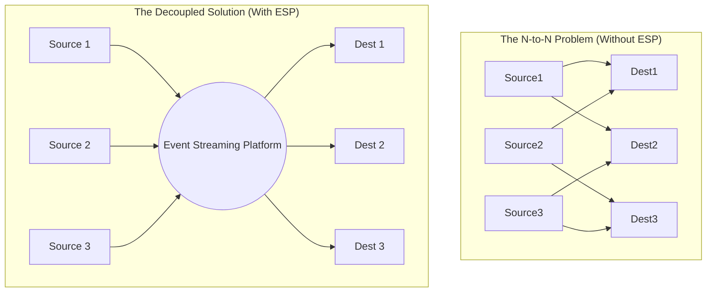
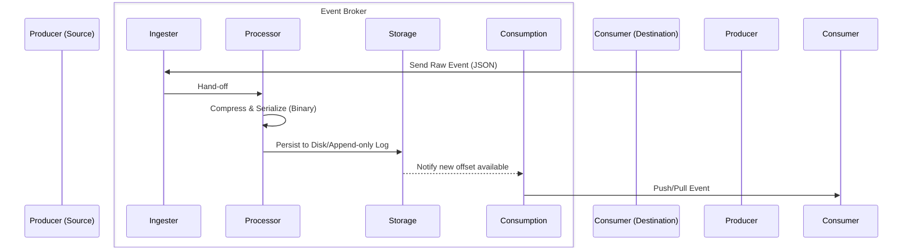

# Module 4, Lecture 1: Distributed Event Streaming Platform Components

## 1. The Anatomy of an Event

In system architecture, an **event** is an immutable record indicating that "something worth noticing has happened." More formally, it is a data point describing an entity's observable state update at a specific point in time.

Because events are immutable (they represent history, which cannot be changed), they are ideal for distributed systems where state must be reconstructed or audited.

### 1.1 Common Event Formats

Events can range from simple scalar values to complex nested structures. Modern data engineering typically categorizes them into three formats.

Below are C# representations using `record` types, which are perfectly suited for events due to their inherent immutability and value-based equality.

**A. Primitive Type**
The simplest form of an event, carrying only a raw value (e.g., plain text, a number, or a boolean).

```csharp
// Example: A raw temperature reading without context.
public record PrimitiveEvent(double Value);

```

**B. Key-Value Format**
Provides context by associating a specific identifier (the key) with a state (the value). The value can be primitive or complex (JSON, XML, binary tuple).

```csharp
// Example: GPS coordinates tied to a specific vehicle.
public record GpsState(double Latitude, double Longitude);
public record CarGpsEvent(string CarId, GpsState Coordinates);

```

**C. Key-Value with Timestamp (Time-Series)**
The most robust and common format in streaming. It injects temporal context, allowing systems to handle out-of-order delivery, windowing, and time-series analysis.

```csharp
// Example: Blood pressure reading with temporal context.
public record BloodPressureMeasurement(int Systolic, int Diastolic);
public record PatientVitalsEvent(
    string PatientId, 
    BloodPressureMeasurement Vitals, 
    DateTimeOffset Timestamp
);

```

---

## 2. The "N-to-N" Integration Problem

Event streaming is the continuous transportation of these events from a source (sensors, databases, applications) to a destination (data warehouses, file systems, other applications).

In a naive architecture, engineers might build direct ETL pipelines between every source and destination using various protocols (HTTP, FTP, JDBC). As the system scales, this results in an unmaintainable "spaghetti" architecture.

### Architectural Comparison



To solve the $O(N^2)$ complexity of direct connections, we introduce an intermediary layer.

---

## 3. Event Streaming Platform (ESP) Architecture

An ESP acts as a highly scalable, fault-tolerant middle layer. It decouples the producers of data from the consumers, providing a unified interface for event-based ETL.

### 3.1 Core Components of an ESP

| Component | Description | Technical Responsibility |
| --- | --- | --- |
| **Event Broker** | The central nervous system of the ESP. | Handles the ingestion, processing, and routing of data streams. |
| **Event Storage** | The persistence layer. | Buffers events to disk or memory, allowing consumers to process data at their own pace without dropping messages. |
| **Query/Analytic Engine** | The computation layer. | Allows for real-time aggregations, filtering, and windowing directly on the stream (e.g., ksqlDB). |

### 3.2 Deep Dive: The Event Broker

The Event Broker is the engine of the platform and is generally divided into three sub-routines:

1. **Ingester:** Efficiently accepts high-throughput incoming connections from varied sources.
2. **Processor:** Executes middleware logic such as:
* *Serialization/Deserialization* (e.g., converting C# objects to Protobuf or Avro).
* *Compression/Decompression* (e.g., Snappy, Gzip) to reduce network payload.
* *Encryption/Decryption* (TLS/SSL).


3. **Consumption (Dispatcher):** Manages subscriber offsets and efficiently pushes or allows pulling of events to the destinations.



### 3.3 C# Conceptual Implementation of a Broker Interface

To understand how these components interact programmatically, consider this abstracted C# interface defining a basic broker's contract:

```csharp
using System.Threading.Tasks;
using System.Collections.Generic;

namespace StreamingPlatform.Core
{
    public interface IEventBroker<TEvent>
    {
        // 1. Ingestion: Receive an event and acknowledge receipt
        Task<bool> PublishAsync(string topic, TEvent eventData);

        // 2. Processing (Internal mechanism, often injected via middleware)
        // e.g., Task<byte[]> SerializeAndCompress(TEvent eventData);

        // 3. Consumption: Subscribe to a stream and process via a callback
        Task SubscribeAsync(string topic, string consumerGroupId, Func<TEvent, Task> onMessageReceived);
    }
}

```

---

## 4. The Industry Landscape

While the architectural principles remain consistent, various tools have been developed to handle ESP requirements, each with specific strengths:

* **Apache Kafka:** The industry standard. An open-source, distributed commit log known for massive throughput and fault tolerance.
* **Amazon Kinesis:** AWS's fully managed real-time streaming service.
* **Apache Flink:** Highly focused on stateful computations and exact real-time stream processing (often paired with Kafka).
* **Azure Event Hubs:** Microsoft’s fully managed, Kafka-compatible data streaming platform.
* **IBM Event Streams:** An enterprise-grade event streaming platform built on Apache Kafka.

Here is a highly technical, expanded breakdown of Module 4, Lecture 1: "Distributed Event Streaming Platform Components." This lecture transitions from traditional batch ETL to the paradigm of continuous, asynchronous data flow.

---