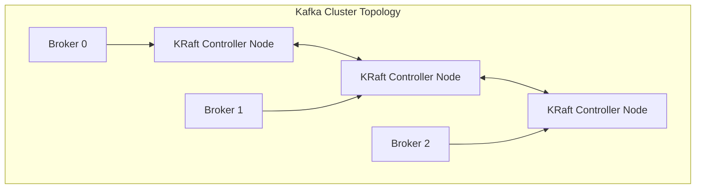
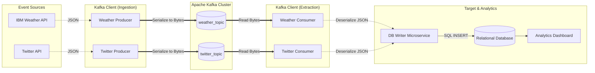

# Module 4, Lecture 3: Building Event Streaming Pipelines Using Kafka

## 1. The Core Cluster Topology: Brokers and KRaft

At the hardware and network level, a Kafka environment is not a monolithic application; it is a distributed cluster of **Brokers**.

- **Brokers:** These are dedicated servers responsible for receiving, storing, processing, and distributing events.
- **KRaft (Kafka Raft):** Modern Kafka utilizes controller nodes running the KRaft consensus protocol to manage the cluster's metadata log. This replaces the legacy Zookeeper dependency, streamlining the architecture by keeping metadata state natively within Kafka.



---

## 2. Data Organization: Topics, Partitions, and Replicas

Kafka organizes data into logical containers called **Topics**. You can conceptualize a topic as an append-only, distributed database table for a specific category of events (e.g., `log_topic`, `transaction_topic`, `gps_topic`).

To achieve massive throughput and fault tolerance, topics are physically divided:

- **Partitions:** A topic is split into multiple partitions distributed across different brokers. This allows parallel writing and reading.
- **Replications:** Each partition is duplicated across multiple brokers. If Broker 0 fails, clients automatically failover to the replica on Broker 1.

### CLI Topic Management

Kafka provides shell scripts to manage this infrastructure.

```bash
# Create a topic with explicit partitioning and fault tolerance
kafka-topics.sh --create --topic log_topic --partitions 2 --replication-factor 2 --bootstrap-server localhost:9092

# Verify the cluster's topics
kafka-topics.sh --list --bootstrap-server localhost:9092

# Audit the topology of a specific topic
kafka-topics.sh --describe --topic log_topic --bootstrap-server localhost:9092

```

---

## 3. Ingestion: Kafka Producers

**Producers** are client applications that push event payloads into Kafka topics. Kafka guarantees that messages sent to a _specific partition_ by a _single producer_ will be appended in the exact order they were sent.

### The Role of Partition Keys

By default, if a producer sends an event without a key, Kafka uses a round-robin strategy to balance the load across all partitions. However, if order matters for a specific entity (e.g., a specific user's web session), you must provide a **Key**. Kafka hashes the key to ensure that all events with the same key strictly route to the same partition.

### CLI Producer Examples

```bash
# Producing without keys (Round-robin distribution)
kafka-console-producer.sh --topic log_topic --bootstrap-server localhost:9092
> log1
> log2

# Producing with keys (Ensures 'user1' state changes are strictly ordered)
kafka-console-producer.sh --topic user_topic --property parse.key=true --property key.separator=, --bootstrap-server localhost:9092
> user1,login website
> user1,click the top item
> user1,logout website

```

### C# Producer Implementation with Keys

To implement this programmatically in a robust backend, we use `Confluent.Kafka`.

```csharp
using System;
using System.Threading.Tasks;
using Confluent.Kafka;

public class UserActivityProducer
{
    public async Task PublishActivityAsync(string userId, string action)
    {
        var config = new ProducerConfig { BootstrapServers = "localhost:9092" };

        using var producer = new ProducerBuilder<string, string>(config).Build();

        var message = new Message<string, string>
        {
            Key = userId, // Hashes the user ID to guarantee partition routing
            Value = action
        };

        var result = await producer.ProduceAsync("user_topic", message);
        Console.WriteLine($"Written to Partition: {result.Partition.Value}, Offset: {result.Offset.Value}");
    }
}

```

---

## 4. Extraction: Kafka Consumers

**Consumers** are client applications that subscribe to topics. Because Kafka stores events durably on disk, producers and consumers are fully decoupled. A consumer can crash, stay offline for an hour, and resume exactly where it left off.

- **Offsets:** Consumers track their read position using an integer called an offset.
- **Playback:** By resetting the offset to `0`, a consumer can replay the entire historical stream (a very useful feature for auditing, provided you haven't configured a short retention policy).

### CLI Consumer Examples

```bash
# Read only new incoming events
kafka-console-consumer.sh --topic log_topic --bootstrap-server localhost:9092

# Time-travel: Playback all historical events
kafka-console-consumer.sh --topic log_topic --from-beginning --bootstrap-server localhost:9092

```

### C# Consumer Implementation (Playback Mode)

Here is how to configure a C# consumer to act like the `--from-beginning` flag if no previous offset state exists.

```csharp
using System;
using Confluent.Kafka;

public class UserActivityConsumer
{
    public void StartListening()
    {
        var config = new ConsumerConfig
        {
            BootstrapServers = "localhost:9092",
            GroupId = "analytics-group",
            AutoOffsetReset = AutoOffsetReset.Earliest // Equivalant to --from-beginning
        };

        using var consumer = new ConsumerBuilder<string, string>(config).Build();
        consumer.Subscribe("user_topic");

        while (true)
        {
            var consumeResult = consumer.Consume();
            Console.WriteLine($"Key: {consumeResult.Message.Key}, Value: {consumeResult.Message.Value}");
            // Offset is automatically committed back to Kafka asynchronously
        }
    }
}

```

---

## 5. End-to-End Architecture: The Social Weather Pipeline

To synthesize these concepts, the lecture details a pipeline correlating extreme weather with social media sentiment.

The architecture deserializes JSON data from external APIs, buffers it in Kafka, and eventually routes it to a structured relational database for analytical querying.



*Note: In modern enterprise pipelines, the "Consumer -> DB Writer" step is often entirely replaced by **Kafka Connect**, which offers pre-built JDBC sinks to write directly to relational databases without writing custom consumer application code.
