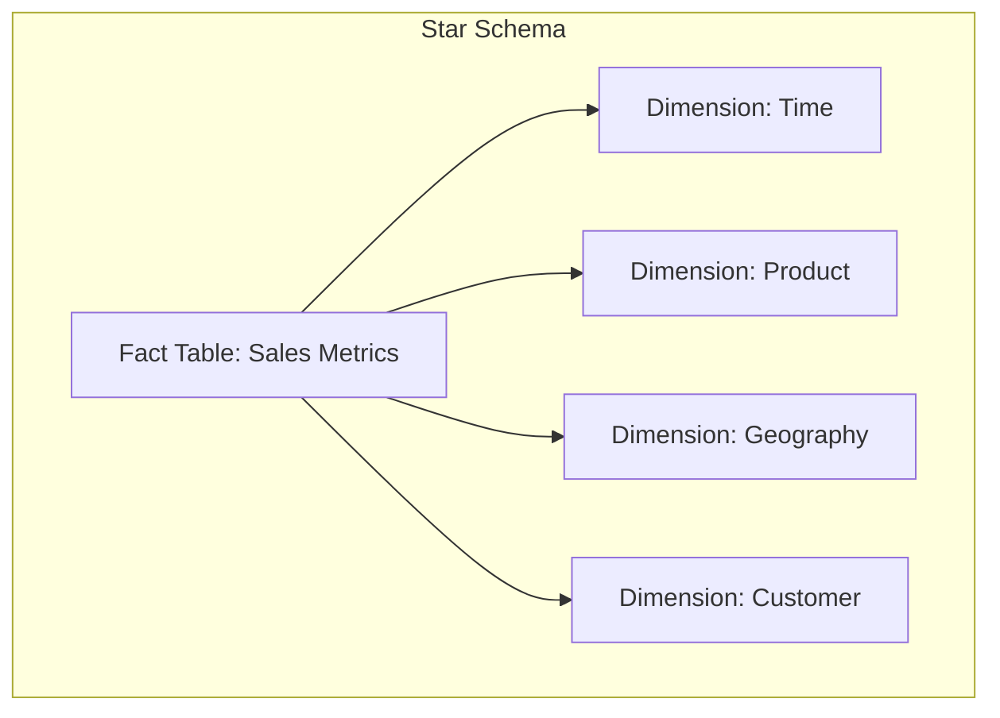
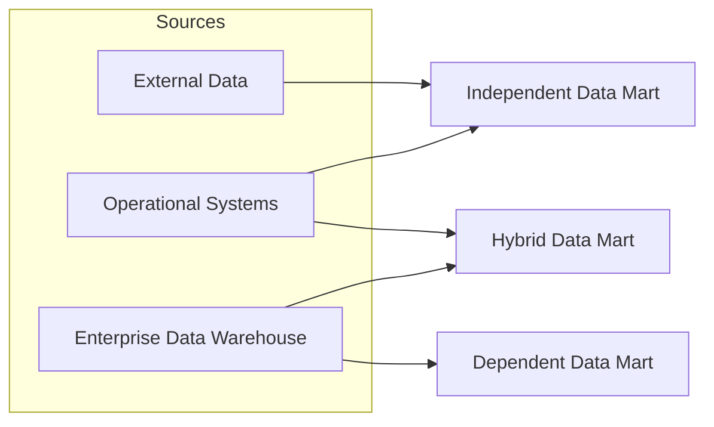

# Module 1, Lecture 4: Data Marts Overview

An enterprise data warehouse serves the strategic needs of the entire organization. But not every team needs—or should have—access to the full breadth of that data. Data marts solve this by carving off focused, tactical slices of the warehouse, purpose-built for specific business functions. They are the mechanism by which analytical infrastructure becomes operationally useful to individual teams.

---

## 1. Defining the Data Mart

A **data mart** is an isolated part of the larger enterprise data warehouse that is specifically built to serve a particular business function, purpose, or community of users.

Examples of organizational data marts:

* **Sales & Finance** — supplying data for quarterly sales reports and projections
* **Marketing** — analyzing customer behavior data
* **Shipping, Manufacturing & Warranty** — each operating with their own dedicated data marts tailored to their domain

Data marts are designed to provide specific, timely support for making **tactical decisions**. By focusing only on the most relevant data, they save end users the time and effort that would otherwise be spent searching the broader data warehouse for insights.

---

## 2. Structural Design: Star and Snowflake Schemas

The typical structure of a data mart is a **relational database** organized using a **star schema** or, more commonly, a **snowflake schema**:

* **Fact Table (Central):** Contains the business metrics relevant to a specific business process (e.g., revenue, units sold, transaction counts).
* **Dimension Tables (Surrounding):** Provide contextual hierarchies for the facts—time, geography, product category, customer segment—enabling multidimensional analysis.

In a snowflake schema, dimension tables are further normalized into sub-dimension tables, reducing redundancy at the cost of additional joins.

---

## 3. Data Marts vs. Transactional Databases vs. Data Warehouses

### 3.1 Data Marts and Databases Compared

| Characteristic | Data Mart (OLAP) | Transactional Database (OLTP) |
| --- | --- | --- |
| **Optimization** | Read-intensive analytical queries | Write-intensive transactional operations |
| **Data Source** | Enterprise data warehouse or operational systems | Operational applications (e.g., point-of-sale systems) |
| **Data Quality** | Validated, transformed, and cleaned | Raw, uncleaned data |
| **Historical Depth** | Accumulates historical data for trend analysis | May not retain older data |

### 3.2 Data Marts and Data Warehouses Compared

| Characteristic | Data Mart | Data Warehouse |
| --- | --- | --- |
| **Scope** | Tactical — serves a specific business function | Strategic — supports enterprise-wide requirements |
| **Size** | Smaller, leaner | Very large |
| **Performance** | Fast — narrow scope enables optimized queries | Can be slower due to the breadth and volume of data |

---

## 4. The Three Types of Data Marts

The classification of data marts depends on their relationship with the enterprise data warehouse and their data sources.

### 4.1 Dependent Data Marts

Dependent data marts draw their data **exclusively from the enterprise data warehouse**. Because the warehouse has already cleaned and transformed the data, these marts benefit from:

* **Simpler ETL pipelines** — no transformation logic required at the mart level
* **Inherited security** — the warehouse's governance and access controls cascade down

### 4.2 Independent Data Marts

Independent data marts **bypass the data warehouse entirely**, sourcing data directly from internal operational systems or external vendors. This independence comes with additional requirements:

* **Custom ETL pipelines** — full extract, transform, and load logic must be built to handle raw source data
* **Separate security measures** — the mart cannot rely on the warehouse's security posture

### 4.3 Hybrid Data Marts

Hybrid data marts **partially depend** on the enterprise data warehouse, combining warehouse data with inputs from operational systems and external sources. They occupy the middle ground between dependent and independent marts.

---

## 5. The Purpose of a Data Mart

Regardless of type, every data mart exists to:

* **Deliver relevant data** to end users when they need it
* **Accelerate business processes** through efficient query response times
* **Enable cost-efficient, data-driven decisions** without requiring access to the full warehouse
* **Ensure secure access and control** over domain-specific data

---

Would you like to explore how star and snowflake schemas are physically modelled in SQL, or should we move into examining specific data warehouse platforms like IBM Db2 Warehouse and how they support data mart development?
