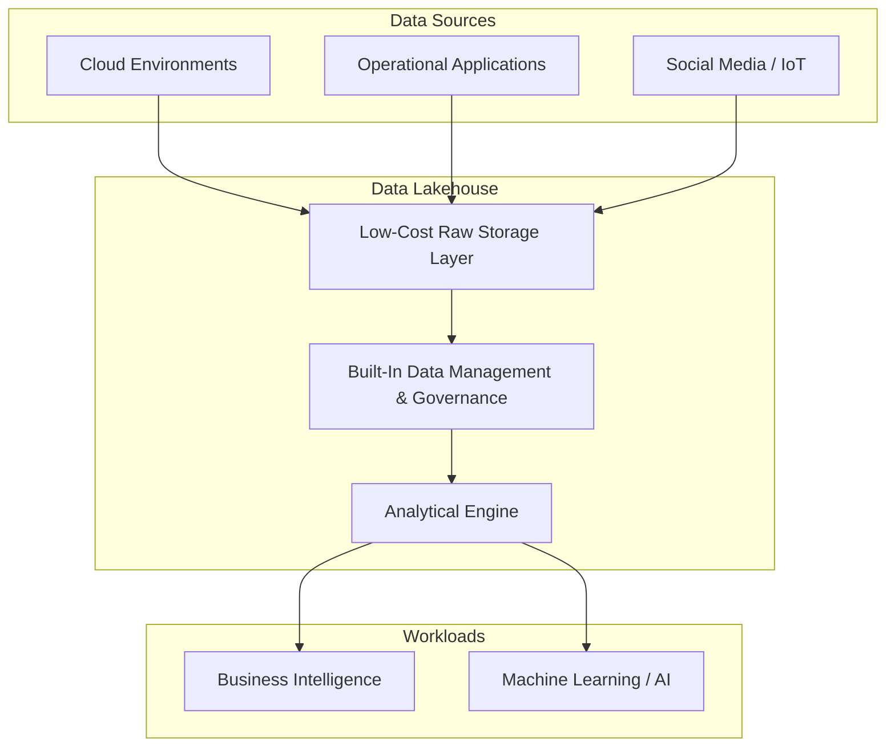

# Module 1, Lecture 7: Data Lakes, Data Warehouses, and the Data Lakehouse

Understanding data architecture through analogy clarifies why no single storage paradigm solves every problem. A commercial kitchen—where raw ingredients must be received, sorted, stored under specific conditions, and prepared to order—mirrors the data flows that modern organizations must orchestrate. The data lakehouse is the architectural response to the limitations encountered when data lakes and data warehouses operate in isolation.

---

## 1. The Kitchen Analogy: From Raw Ingredients to Insights

### 1.1 The Loading Dock — Data Ingestion

In a commercial kitchen, raw ingredients arrive on palettes from supplier trucks. They must be immediately unwrapped, sorted, labelled, and routed to the correct storage area—pantries for dry goods, walk-in fridges and freezers for perishables. Speed is critical: delays cause spoilage and waste.

In a data architecture, the equivalent is **data ingestion**—raw data arriving from diverse sources: cloud environments, operational applications, social media streams, IoT sensors. It arrives in different formats, at different velocities, and must be captured quickly before it loses value.

### 1.2 The Pantry and Freezer — Storage and Governance

Kitchen storage requires organization: FIFO (first in, first out) rotation, contamination separation, temperature controls. Without this governance, the cooks cannot do their job safely or efficiently—they would spend more time searching for ingredients than actually cooking.

Similarly, data must be **cleaned, organized, and governed** in storage systems before it can be reliably consumed by downstream analytics.

---

## 2. Data Lakes: The Loading Dock of Data Architecture

**Data lakes** provide a low-cost, high-speed repository for capturing raw data in all formats—structured, semi-structured, and unstructured. They serve the same function as the loading dock: get everything off the truck and into storage as quickly as possible.

### Challenges with Data Lakes

| Challenge                     | Description                                                                                                                                                       |
| ----------------------------- | ----------------------------------------------------------------------------------------------------------------------------------------------------------------- |
| **Data Governance & Quality** | Without rigorous governance, data lakes degrade into **data swamps**—filled with duplicate, inaccurate, or incomplete data that is difficult to track and manage. |
| **Data Staleness**            | Ungoverned data degrades over time, losing its value for generating insights—just as unused kitchen ingredients eventually spoil.                                 |
| **Query Performance**         | Data lakes are not optimized for complex analytical queries. Extracting insights directly from a lake can be slow and operationally difficult.                    |

---

## 3. Enterprise Data Warehouses: The Organized Kitchen

**Enterprise Data Warehouses (EDWs)** are the organized pantries and freezers of data architecture. Data is loaded—sometimes from a data lake, sometimes directly from operational applications—then **cleaned, structured, and optimized** for specific analytical tasks.

EDWs excel at powering:

- **Business Intelligence (BI) workloads** — dashboards, reports, and visualizations
- **Structured analytical queries** with high performance and concurrency

### Challenges with Data Warehouses

| Challenge                             | Description                                                                                                                               |
| ------------------------------------- | ----------------------------------------------------------------------------------------------------------------------------------------- |
| **High Cost**                         | Like enterprise-grade walk-in freezers, data warehouses are expensive to operate. Not everything can—or should—be loaded into one.        |
| **Limited Unstructured Data Support** | Warehouses have limited support for semi-structured and unstructured data—precisely the data types growing fastest in most organizations. |
| **Latency**                           | The time required to sort, clean, and load data into the warehouse can make it too slow for applications requiring the freshest data.     |

---

## 4. The Data Lakehouse: Best of Both Worlds

Recognizing the complementary strengths and opposing weaknesses of data lakes and data warehouses, engineers developed a convergent architecture: the **data lakehouse**.

### 4.1 Core Value Proposition

The data lakehouse combines:

- **The flexibility and cost-effectiveness of a data lake** — store data from an exploding number of sources at low cost
- **The performance and structure of a data warehouse** — built-in data management and governance layers enable both BI and high-performance ML workloads

### 4.2 Adoption Paths

Organizations can approach the data lakehouse through several routes:

- **Modernize existing data lakes** — layer governance and query optimization on top of current lake infrastructure
- **Complement existing data warehouses** — extend warehouse capabilities to support new AI and machine learning-driven workloads that require semi-structured and unstructured data

---

## 5. Comparative Summary

| Dimension             | Data Lake                                       | Data Warehouse       | Data Lakehouse    |
| --------------------- | ----------------------------------------------- | -------------------- | ----------------- |
| **Cost**              | Low                                             | High                 | Moderate          |
| **Data Types**        | All (structured, semi-structured, unstructured) | Primarily structured | All               |
| **Governance**        | Weak (risk of data swamp)                       | Strong               | Strong (built-in) |
| **Query Performance** | Low for complex analytics                       | High                 | High              |
| **ML/AI Support**     | High (raw data access)                          | Limited              | High              |
| **BI Support**        | Limited                                         | High                 | High              |

---

Would you like to dive into the specific architectural components of a data lakehouse—such as the open table format layer (Delta Lake, Apache Iceberg)—or should we examine how ETL and ELT pipelines are redesigned to feed lakehouse architectures?
